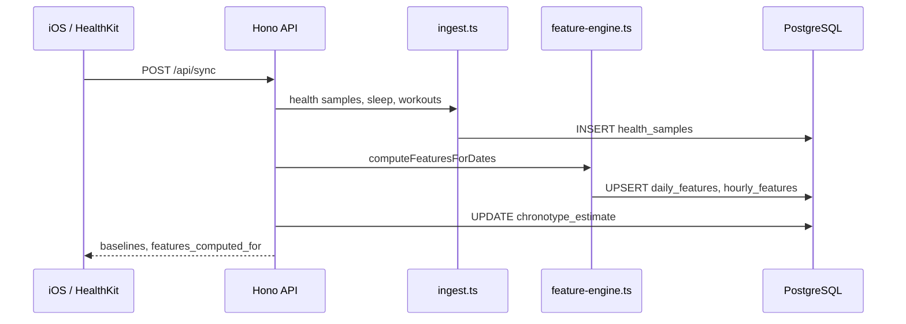
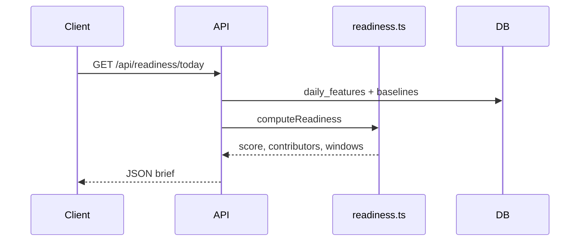

# Architecture

Cortex Bio is a **wearable intelligence platform** — not a dashboard, not a productivity tracker. It is a layered system that turns physiological signals into structured features, explainable forecasts, and (with ground truth) validated predictions.

## Design principles

1. **Feature store first** — `daily_features` and `hourly_features` are the asset; everything else is derived.
2. **Append-only raw data** — `health_samples` are never updated; recomputation is always possible.
3. **Explainability before ML** — rules-based readiness ships before black-box models.
4. **Baseline-gated ML** — models must beat yesterday, rolling average, and readiness heuristics.
5. **Clear OSS boundary** — engine is open; Cortex commercial layer is separate.

## System context

```text
┌──────────────┐  ┌──────────────┐  ┌──────────────┐  ┌──────────────┐
│ Apple Health │  │    WHOOP     │  │     Oura     │  │    Garmin    │
│  HealthKit   │  │   (future)   │  │   (future)   │  │   (future)   │
└──────┬───────┘  └──────┬───────┘  └──────┬───────┘  └──────┬───────┘
       │                 │                 │                 │
       └─────────────────┴────────┬────────┴─────────────────┘
                                  │
                                  ▼
                         ┌────────────────┐
                         │   Cortex Bio   │
                         │  ingest + API  │
                         └────────┬───────┘
                                  │
              ┌───────────────────┼───────────────────┐
              ▼                   ▼                   ▼
        ┌───────────┐       ┌───────────┐       ┌───────────┐
        │  iOS app  │       │  Your API │       │  Agents   │
        │  SwiftUI  │       │  clients  │       │  / LLMs   │
        └───────────┘       └───────────┘       └───────────┘
```

## Repository layout

```text
cortex-bio/
├── ios/                 Reference HealthKit client (SwiftUI)
├── api/                 Ingest + intelligence REST API (Hono + TypeScript)
│   └── src/
│       ├── services/    Domain logic (feature engine, readiness, ML, …)
│       ├── routes/      HTTP handlers
│       └── lib/         Prisma client, timezone, user resolution
├── db/                  Prisma schema, migrations, seed, SQL views
│   └── prisma/
├── ml/                  XGBoost training and evaluation scripts
├── docs/                Extended documentation
├── README.md
├── ARCHITECTURE.md      ← you are here
├── ROADMAP.md
└── CONTRIBUTING.md
```

## Layer model

### Layer 1 — Raw ingest

| Table | Mutability | Source |
|-------|------------|--------|
| `health_samples` | Append-only | HealthKit metrics (HRV, HR, steps, energy) |
| `sleep_sessions` | Upsert | HealthKit sleep analysis |
| `workouts` | Upsert | HealthKit workouts |

**Service:** `api/src/services/ingest.ts`  
**Entry:** `POST /api/sync`

Deduplication uses `(user_id, metric_type, start_time, value)` to tolerate re-syncs.

### Layer 2 — Feature store

| Table | Granularity | Key fields |
|-------|-------------|------------|
| `daily_features` | Calendar day | sleep, HRV, resting HR, steps, exercise, readiness |
| `hourly_features` | Hour bucket | HR, HRV, steps, activity score |

**Service:** `api/src/services/feature-engine.ts`

Sleep uses the **primary session** (longest) per night to avoid double-counting naps.

SQL views: `v_user_baselines`, `v_weekly_features`, `v_monthly_features`.

### Layer 3 — Knowledge

| Capability | Service | Output |
|------------|---------|--------|
| Chronotype | `chronotype.ts` | `morning_lark` … `night_owl` on `users.chronotype_estimate` |
| Baselines | `feature-engine.ts` | 30-day rolling means for HRV, sleep, HR |
| Insights | `analytics.ts` | Correlation-driven `insights` rows |
| Readiness | `readiness.ts` | `rules-v1` score + contributors |

### Layer 4 — Forecasts

| Capability | Service | Output |
|------------|---------|--------|
| Cognitive windows | `cognitive-windows.ts` | Hourly curve, peak/crash/meeting/recovery windows |
| 24h forecast | `forecast.ts` | Scaled hourly curve + best deep-work window |
| Legacy readiness windows | `predictions` table | Peak/crash from rules engine |

Windows combine: work session quality, hourly features, chronotype priors.

### Layer 5 — Ground truth

| Table | OSS use | Proprietary use |
|-------|---------|-----------------|
| `daily_labels` | Self-reported 1–5 scores | — |
| `work_sessions` | Session quality ratings | — |
| `cortex_daily_metrics` | Integration stub | Real Cortex telemetry |

### Layer 6 — ML and validation

```text
v_training_dataset (view)
        │
        ▼
   ml/train.py  ──►  model_runs
        │
        ▼
 performance_predictions
        │
        ▼ (when actuals arrive)
 prediction_validations  ──►  validation_metrics
```

**Services:** `ml.ts`, `validation.ts`, `cortex.ts`

Training features: sleep, HRV, activity, chronotype, weekday.  
Targets (proprietary ground truth): attention, deep work minutes, output score.

## Open source vs proprietary

| | Open Source | Proprietary (Atriveo) |
|---|-------------|----------------------|
| **License** | MIT | Commercial |
| **Ingest** | HealthKit | Cortex telemetry |
| **Ground truth** | Labels + sessions | Cortex performance metrics |
| **Models** | Self-trained XGBoost/ridge | Production scoring models |
| **API** | Self-hosted `/api/*` | Hosted `/v1/*` platform |
| **Datasets** | Seed + your own data | Production Cortex datasets |

Detail: [docs/OPEN_SOURCE.md](./docs/OPEN_SOURCE.md)

## Request flow (sync)



## Request flow (readiness)



## Technology choices

| Layer | Choice | Rationale |
|-------|--------|-----------|
| Mobile | SwiftUI + HealthKit | Native Apple Watch pipeline |
| API | Hono + TypeScript | Lightweight, type-safe, edge-ready |
| ORM | Prisma | Schema-as-code, Neon-compatible |
| Database | PostgreSQL (Neon) | Relational feature store, SQL views |
| ML | XGBoost + scikit-learn | Interpretable, no LLM/transformer dependency |
| Time | Luxon | Timezone-safe date handling |

## Multi-user readiness

The schema is multi-tenant (`user_id` UUID on all tables). The reference deployment uses `DEFAULT_USER_EMAIL` for N=1 research mode. Production `/v1` API will add auth and API keys.

## Security notes (self-hosted)

- No auth in reference API — run behind VPN or add middleware before exposing publicly.
- `DATABASE_URL` is the only required secret.
- Health data is sensitive; encrypt at rest (Neon default) and use TLS in transit.

## Related projects

- **health-auto-export-server** — sibling repo; Mongo + Grafana ingest path for Health Auto Export app. Cortex Bio is the product intelligence stack.
- **Atriveo Cortex** — proprietary knowledge-work telemetry (commercial).
